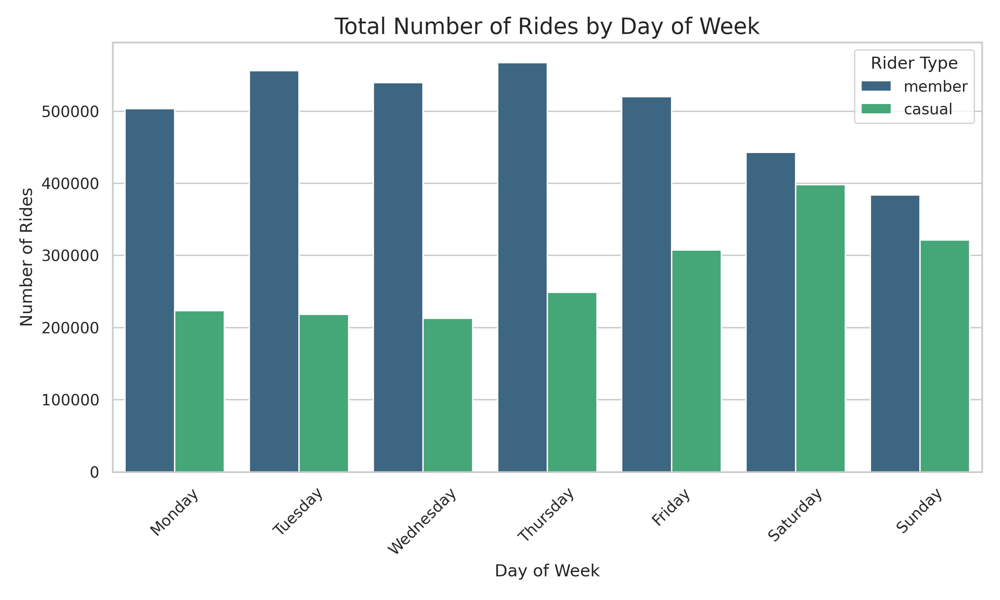
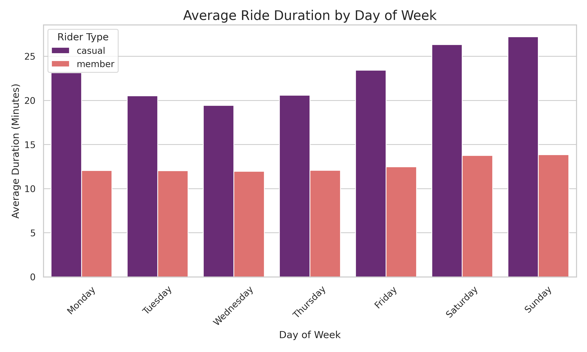
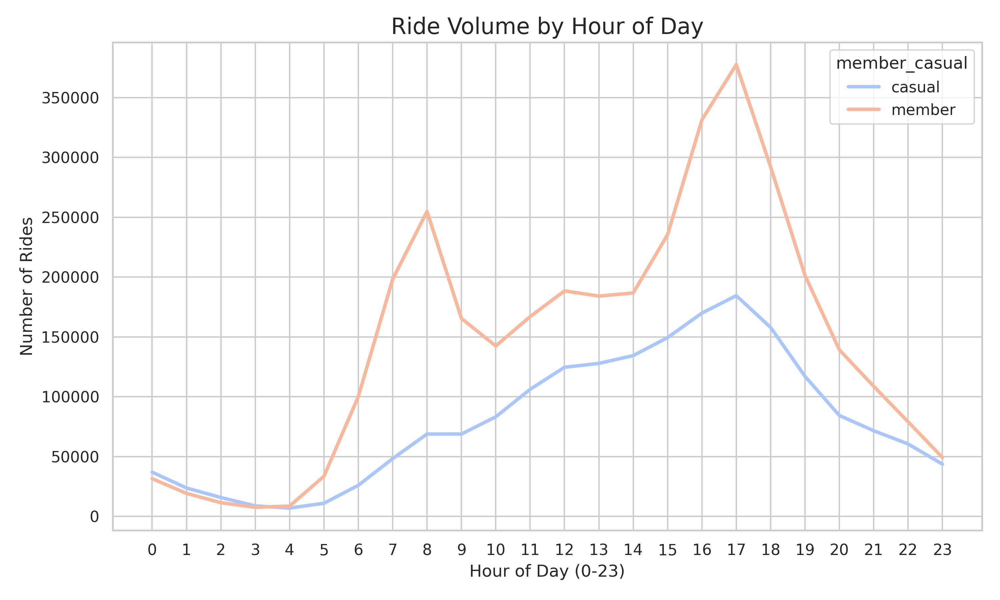

# Cyclistic Bike-Share Analysis Case Study

## Project Overview
This project is part of the Google Data Analytics Professional Certificate. The goal is to analyze historical bike trip data to identify trends in how different customer types utilize Cyclistic bikes. The analysis will guide marketing strategies aimed at converting casual riders into annual members.

## Business Task
Cyclistic is a bike-share company in Chicago. The Director of Marketing believes the company’s future success depends on maximizing the number of annual memberships. The marketing analytics team wants to understand how "Casual" riders (single-ride or full-day pass users) and "Annual Members" use Cyclistic bikes differently.

**The Stakeholders:**
* **Lily Moreno:** Director of Marketing.
* **Cyclistic Executive Team:** The decision-makers who must approve the recommended marketing program.

## Data Sources
The analysis utilizes the previous 12 months of historical trip data made publicly available by Motivate International Inc here: https://divvy-tripdata.s3.amazonaws.com/index.html. The dataset includes ride start/end times, station names, and rider type (casual vs. member).

**Data Constraints:**
Data-privacy issues prohibit the use of personally identifiable information. We cannot connect pass purchases to credit card numbers to determine if casual riders live in the service area.

## Tools Used
* **Python (Pandas):** For data cleaning, manipulation, and aggregation.
* **Matplotlib & Seaborn:** For data visualization.
* **Jupyter Notebook / Google Colab:** For executing the analysis script.

## Data Cleaning & Processing
To prepare the data for analysis, the following steps were taken:
1.  **Data Merging:** Concatenated 12 separate monthly CSV files into a single dataframe.
2.  **Date Formatting:** Converted `started_at` and `ended_at` columns to datetime objects.
3.  **Feature Engineering:**
    * Calculated `ride_length_minutes` by subtracting start time from end time.
    * Extracted `day_of_week` and `hour` to analyze temporal trends.
4.  **Data Cleaning:**
    * Removed rides with a duration of less than 1 minute (false starts) or negative durations (system errors).

## Analysis & Visualizations

### 1. Total Rides by Day of Week

**Key Insight:**
* **Annual Members** exhibit higher usage on weekdays (Tuesday through Thursday), indicating that they primarily use the service for commuting to and from work.
* **Casual Riders** usage peaks significantly on Saturdays and Sundays, suggesting they use the service primarily for leisure and weekend activities.

### 2. Average Ride Duration by Rider Type

**Key Insight:**
* There is a drastic difference in ride duration between the two groups.
* **Casual Riders** take rides that are significantly longer than members on average (often 2x longer). This reinforces the theory that casual users are riding for leisure or sightseeing, while members are focused on efficiency (getting from point A to point B).

### 3. Hourly Usage Patterns

**Key Insight:**
* **Members** show two distinct spikes in usage: 8:00 AM and 5:00 PM. This confirms the hypothesis that members use the bikes for daily work commutes.
* **Casual Riders** show a consistent increase throughout the day, peaking in the late afternoon/early evening and on weekends, consistent with recreational use rather than commuting.

## Recommendations
Based on the analysis of how casual riders and annual members use the bikes differently, the following marketing strategies are recommended to convert casual riders into members:

1.  **Introduce a "Weekend Warrior" Membership:** Since casual usage peaks on weekends, create a special membership tier that offers unlimited rides on Saturdays and Sundays at a competitive price point.
2.  **Targeted Digital Campaigns:** Utilize digital media to target casual riders during peak leisure hours (weekends and afternoons) with messages emphasizing the cost-savings of membership for frequent weekend trips.
3.  **Commuter Incentives:** To bridge the gap between leisure and utility, offer casual riders a discount on their first month of membership if they complete a ride during weekday rush hours (7-9 AM or 4-6 PM).

## Conclusion
The data clearly shows that Annual Members and Casual Riders are distinct segments with different motivations. Members value utility and efficiency for commuting, while Casual riders value leisure and recreation. Marketing efforts should focus on bridging this gap by showing Casual riders the value of membership for their specific leisure habits.
